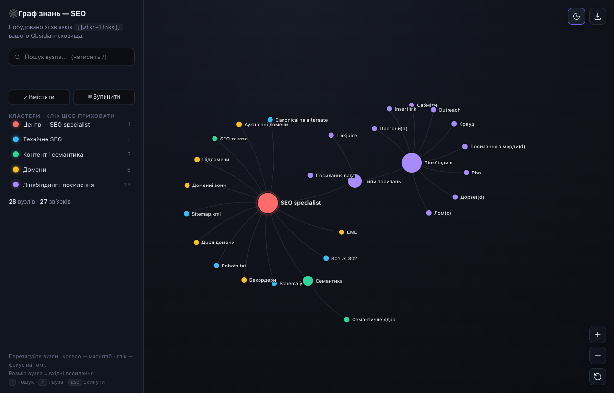

# SEO Knowledge Graph 🕸

Інтерактивний viewer графа знань, побудований з Obsidian-сховища за звʼязками `[[wiki-links]]`.

**28 вузлів · 27 звʼязків.** Статичний сайт без збірки та бекенду: `index.html` + `notes.js` (повні тексти нотаток), D3.js і marked з CDN.

## Можливості
- **Кластери за темами** — вузли пофарбовані за напрямком: Технічне SEO, Контент і семантика, Домени, Лінкбілдинг і посилання.
- **Force-directed layout** з мʼякою гравітацією, що тримає кластери компактними; криві звʼязки в стилі Obsidian.
- **Панель деталей справа** — клік на вузол (ліва **або** права кнопка) відкриває праворуч панель-інспектор: тема, тип, вхідні/вихідні звʼязки, кількість сусідів, батьківська тема й дочірні нотатки як клікабельні переходи та кнопка «Центрувати». Граф автоматично центрує вибраний вузол у видимій частині, а сусіди підсвічуються (фокус-режим). Повторний клік або `Esc` — закрити.
- **Повний текст нотатки** — у панелі деталей рендериться пояснення з Obsidian-нотатки (Markdown: заголовки, списки, таблиці, код), а `[[вікі-посилання]]` всередині тексту клікабельні й переходять до відповідного вузла.
- **Пошук** із підсвічуванням збігів і переходом до вузла по `Enter`.
- **Фільтри кластерів** — приховуйте/показуйте цілі напрямки кліком по легенді.
- **Світла / темна тема** (запамʼятовується в браузері).
- **Експорт у PNG**, елементи керування масштабом, «Вмістити», пауза симуляції.
- **Гарячі клавіші:** `/` — пошук, `F` — пауза, `Esc` — скинути.
- **Адаптивність** — на мобільному бічна панель згортається в шухляду.

Розмір вузла = кількість вхідних посилань. Великі вузли — це теми-хаби (`SEO specialist`, `Лінкбілдинг`, `Типи посилань`).

## Локальний запуск
Просто відкрийте `index.html` у браузері (подвійний клік) — потрібен інтернет для D3.js і marked з CDN, а `notes.js` має лежати поруч.

## Деплой на GitHub Pages
Після push у репозиторій:
**Settings → Pages → Build and deployment → Source: Deploy from a branch → Branch: `main` / `root` → Save.**

Сайт буде доступний за адресою `https://<username>.github.io/<repo>/`.
Файл `.nojekyll` вимикає обробку Jekyll, щоб усі файли віддавались як є.

## Як це працює
- Дані графа — масив `links` (пари `[нотатка, тема]`) прямо в `index.html`.
- Тексти нотаток — у `notes.js` (обʼєкт `window.NOTES`), згенерований із `.md`-файлів Obsidian-сховища; рендеряться через [marked](https://marked.js.org/).
- Кожен вузол отримує тему за своїм коренем верхнього рівня; кольори, легенда та фільтри будуються автоматично.
- Рендеринг і фізика — [D3.js v7](https://d3js.org/) (`forceSimulation`).

Щоб оновити граф — відредагуйте масив `links` у `index.html`. Щоб оновити тексти — перегенеруйте `notes.js` зі сховища.
